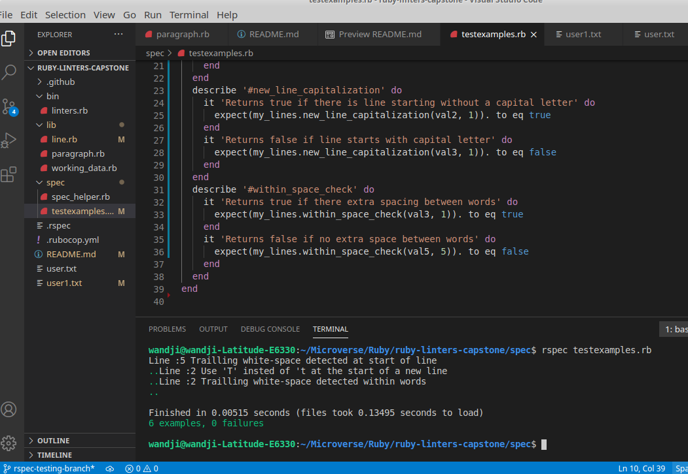

# Text Grammmar Linter

## This project is based on scanning through and input text file and gives it more structure alongside correcting basic grammatic errors.

- It basically throws back errors about
- Wrong capitalization at the start of a new line
- Wromg use of "i'
- Wrong spacing betwwen words(no more that 2 spaces)
- Wrong spacing before(no-space) and after(2 spaces) punctuation marks
- You Must have 2 spaces indentation at the start of text
- Third line must be a title witha 10 space indentation and all words capitalized
- Maximum of 4 paragraphs allowed
- All paragraphes must start with a 2 space indentation and must have a one line indentation at the start and end
- Maximum of 400 words expected to be inputed



## Built With

- Ruby
- Rspec

## Getting Started

To get a local copy up and running the following instructions.

### Prerequisites

Ruby installed in local machine.
RSpec should be installed on local computer.

### Install

1. Clone the repository to your machine via :

```sh
$ git clone https://github.com/wandji20/ruby-linters-capstone
```

2. - Navigate to the project folder and give paste a text in user1.txt
   - Run bin/linters.rb ro get results of faults committed on the console.
   - cd to spec folder and run rspec teast_examples.rb to view test results.

👤 **Author**

- GitHub: [@wandji20](https://github.com/wandji20)
- Twitter: [@wandjibertrand](https://twitter.com/wandjibertrand)
- LinkedIn: [LinkedIn](https://www.linkedin.com/in/wandji-bertrand-5232621b2/)

## 🤝 Contributing

Contributions, issues, and feature requests are welcome!

Feel free to check the [issues page](issues/).

## Show your support

Give a ⭐️ if you like this project!
